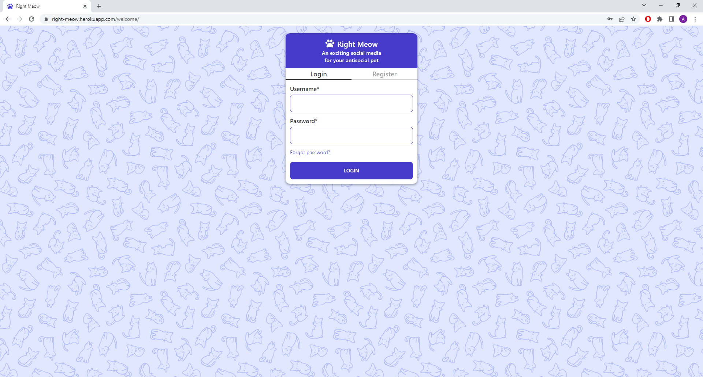
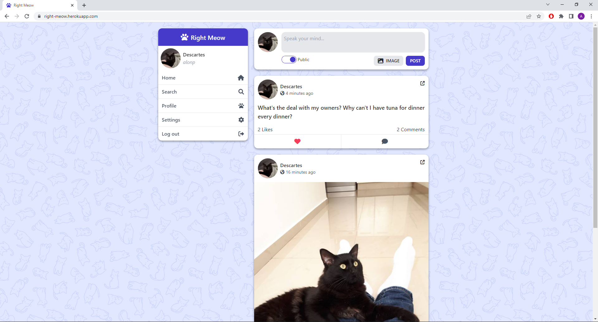
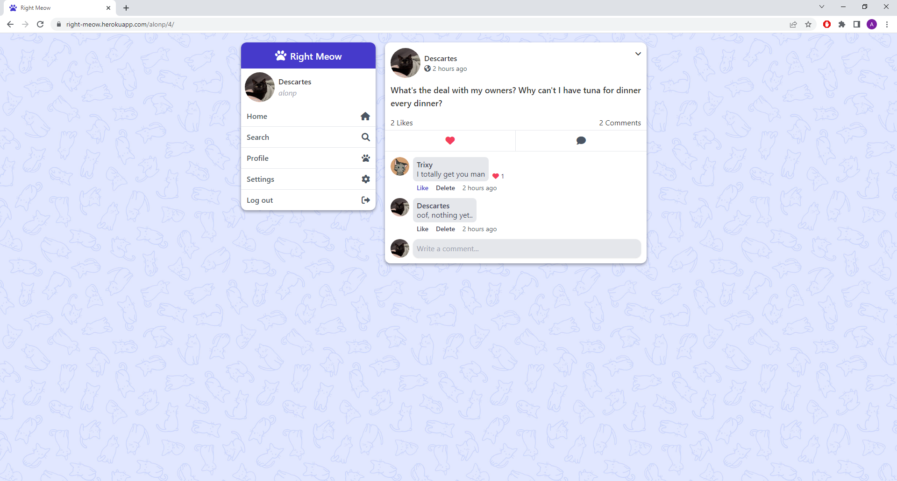
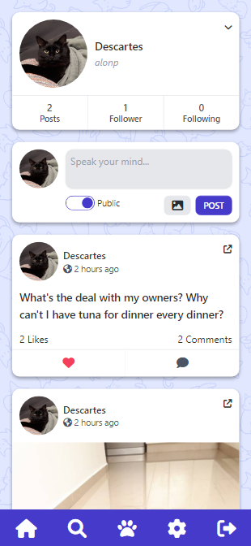

# Right Meow

> A social media for cats, built with Django.
> Live demo [here](https://right-meow.herokuapp.com/).

## Table of Contents

- [General Info](#general-information)
- [Technologies Used](#technologies-used)
- [Features](#features)
- [Screenshots](#screenshots)
- [Setup](#setup)
- [Usage](#usage)
- [Acknowledgements](#acknowledgements)

## General Information

Right Meow is a social media app for cats and cat owners. Users can register, search for other users and follow or unfollow them. They can also upload posts, comment on posts and like posts and comments. A post consists of a short text (up to 250 characters) with an optional image. Additionally, users can edit their profile page and manage their account settings.

## Technologies Used

- HTML, CSS, JavaScript
- Tailwind CSS, daisyUI
- jQuery
- Django
- Node.js
- PostgreSQL
- Media hosted on AWS S3
- Deployed on Heroku

## Features

- Responsive mobile-first design built from scratch
- Fully functional post, comment and like systems
- Likes and comments created with AJAX calls
- Live search
- Infinite scroll with Waypoint
- Additional content rendered asynchronously for efficiency
- Utilization of Django's authentication system
- Rigorous validation and error handling
- Extensive use of class-based views and mixins
- Custom middleware

## Screenshots

<p align="center">
  
</p>
<p align="center">
  
</p>
<p align="center">
  
</p>
<p align="center">
  
</p>

## Setup

To run locally:

1. Set up an [AWS S3 Bucket](https://aws.amazon.com/s3/).
2. Run the following commands:

```
git clone https://github.com/alon-pilosoph/benchmate.git
cd right_meow
npm install
pip install -r requirements.txt
```

3. Set the following environment variables:

```
AWS_ACCESS_KEY_ID=<id>
AWS_SECRET_ACCESS_KEY=<key>
AWS_STORAGE_BUCKET_NAME=<name>
DJANGO_SECRET_KEY=<key>
DJANGO_DEBUG=True
MAIL_USERNAME=<username>
MAIL_PASSWORD=<password>
```

## Usage

1. Navigate to the project's root folder
2. On one terminal, run:

```
npm run tailwind-watch
```

3. On another terminal, run:

```
python manage.py runserver
```

4. Visit development sever at http://127.0.0.1:8000/

Users need to be registed and logged in to access the app. Go to 'Register' to create an account.\
Once registered and logged in, go to 'Search' to look for other users to follow. You can post, comment and like posts or comments.
